# 🛰️ Beamforming Simulator

A full-stack 2D beamforming simulator built with **FastAPI** (backend) and **Angular** (frontend), featuring real-time beam steering, constructive/destructive interference visualization, and three domain-specific applications: **5G Communications**, **Ultrasound Imaging**, and **Radar Detection**.

---

## 📋 Table of Contents

- [Overview](#overview)
- [Tech Stack](#tech-stack)
- [Core Simulator Features](#core-simulator-features)
- [Application Modules](#application-modules)
  - [5G Simulator](#1-5g-simulator)
  - [Ultrasound Simulator](#2-ultrasound-simulator)
  - [Radar Simulator](#3-radar-simulator)
- [Installation](#installation)
- [Usage](#usage)
- [Screenshots](#screenshots)
- [Demo Videos](#demo-videos)

---

## Overview

This simulator models phased array beamforming principles — delays, phase shifts, and constructive/destructive interference — with real-time visualization. It is inspired by tools like MATLAB's Phased Array System Toolbox and is designed as an educational and research platform covering wireless communications, medical ultrasound, and radar systems.

---

## Tech Stack

| Layer | Technology |
|---|---|
| Frontend | Angular |
| Backend | FastAPI (Python) |
| Visualization | Angular Canvas / D3.js / Custom WebGL |
| API Communication | REST + WebSockets |

---

## Core Simulator Features

### Beamforming Parameters (7+ Customizable)

Users can configure the following parameters in real time:

- **Number of array elements** — controls array aperture and resolution
- **Element spacing** (in units of wavelength) — affects grating lobes
- **Operating frequency** — adapts to application scale (GHz for 5G, MHz for ultrasound/radar)
- **Steering angle** — electrically steers the beam direction
- **Phase shift per element** — manual fine-grained phase control
- **Signal amplitude** — sets the transmitted signal strength
- **SNR (Signal-to-Noise Ratio)** — configurable from 0 to 1000; applied to all outputs and measurements across all modules

### Visualization

- **Constructive/Destructive Interference Map** — 2D color-coded spatial field showing wave superposition
- **Beam Profile Viewer** — polar or Cartesian plot of the array factor
- **Synchronized Viewers** — interference map and beam profile update simultaneously in real time

### Apodization / Windowing (Side Lobe Reduction)

Users can apply windowing functions to the array weights to suppress side lobes:

- **Rectangular** (no windowing — default)
- **Hanning**
- **Hamming**
- **Blackman**
- **Kaiser** (with configurable beta parameter)
- **Chebyshev** (with configurable side lobe attenuation level)

The effect on the beam profile (main lobe width vs. side lobe level trade-off) is shown in real time in the beam profile viewer.

---

## Application Modules

### 1. 5G Simulator

Simulates a small-cell 5G beamforming network with interactive tower and user placement.

**Features:**

- Place up to **3 independent 5G base station towers** anywhere on the 2D map
- Place **2 network users** (UEs) that can be moved via **keyboard shortcuts**
- Each tower displays and auto-updates its beamforming parameters (steering angle, frequency, gain) as users move — updates are visually highlighted in the UI
- **Beam connectivity** between each tower–user pair is color-coded based on proximity and signal strength
- **Multi-user connectivity**: a single tower can serve multiple users simultaneously if both fall within its coverage area
- Distance-based signal attenuation is reflected in all output metrics

**Scale:** Distances in meters, frequencies in the GHz range.

---

### 2. Ultrasound Simulator

Simulates A-mode, B-mode, and Doppler ultrasound scanning on a **Shepp–Logan phantom**.

**Features:**

**Phantom & Tissue Properties**
- Interactive Shepp–Logan phantom with tissue regions, each assigned realistic ultrasound properties:
  - Acoustic impedance
  - Speed of sound
  - Attenuation coefficient
  - Density
  - Echogenicity
- **Hover** over any phantom region to view its properties in a tooltip
- **Click** any region to open an editor and modify its properties

**A-Mode**
- Ultrasound probe is constrained to the phantom's outer surface
- User can adjust **probe position** along the surface and **beam steering direction**
- Real-time A-mode (amplitude vs. depth) output reflecting tissue reflections based on acoustic impedance mismatches

**B-Mode**
- Move the probe across the surface while varying scan angles to accumulate scan lines
- Reconstructed 2D B-mode image built from A-mode sweeps

**Doppler Mode**
- Simulated blood vessel with configurable:
  - Vessel orientation angle
  - Blood flow velocity
  - Flow direction (toward / away from probe)
- Doppler frequency shift computed from probe return signal
- Doppler spectrum output visualized in real time

**Scale:** Distances in cm, spatial resolution in mm, frequencies in the MHz range.

---

### 3. Radar Simulator

Simulates a 360° electronically steered phased array radar system.

**Features:**

- Full **360° beam steering** via electronic phase shifting (no mechanical rotation)
- Configurable **scanning speed** and **beam width**
  - Wide beam → fast broad scan to detect presence of objects
  - Narrow beam → slow focused scan for accurate size estimation
- Place up to **5 solid bodies** at arbitrary positions and angles around the radar origin
- For each body:
  - Freely set **size**
  - **Move** the body interactively
  - **Delete** the body and observe output changes
- Radar returns are visualized on a **PPI (Plan Position Indicator)** display
- Reflected signal strength reflects body size, distance, and beam width
- Supports the two-phase scan workflow: broad detection scan → narrow confirmation scan

**Scale:** Distances in meters, frequencies in the GHz/MHz range depending on resolution mode.


## Screenshots

### Core Beamforming Simulator

#### Interference Map & Beam Profile
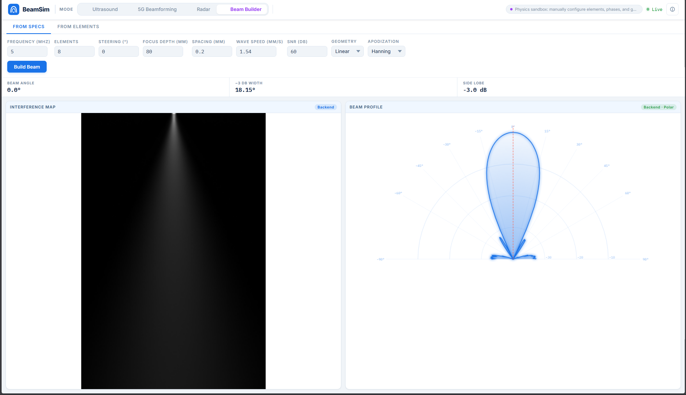

#### Apodization / Windowing Comparison
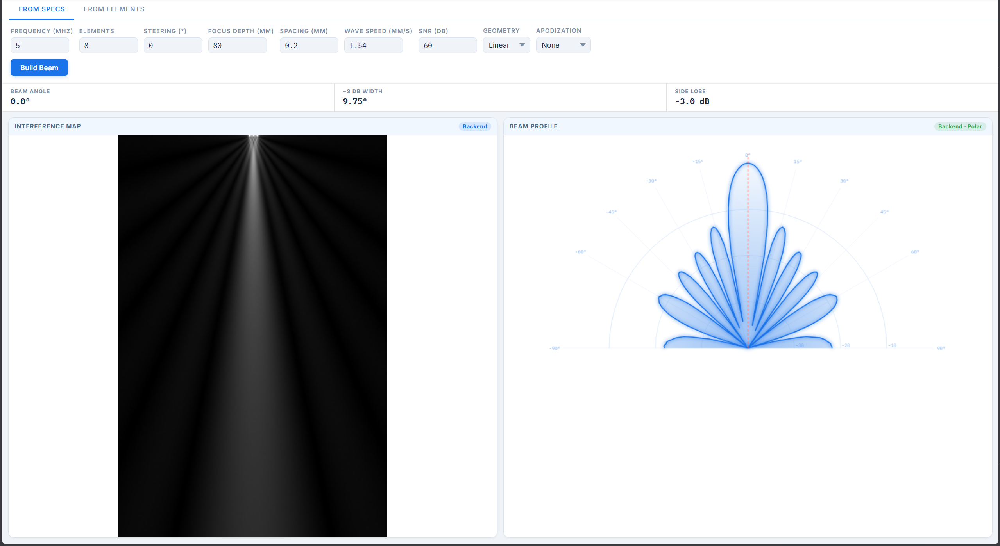
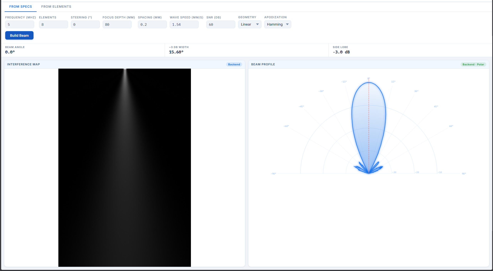


---

### 5G Simulator

#### Tower and User Placement
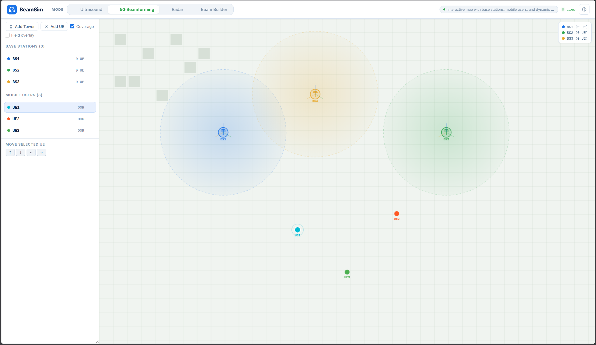


#### Beam Connectivity & Auto-Updated Tower Parameters
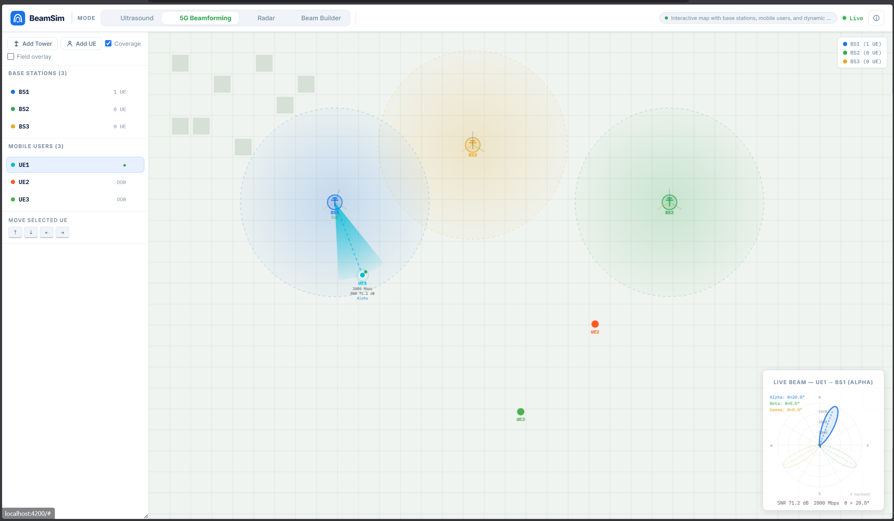

#### Multi-User Tower Coverage
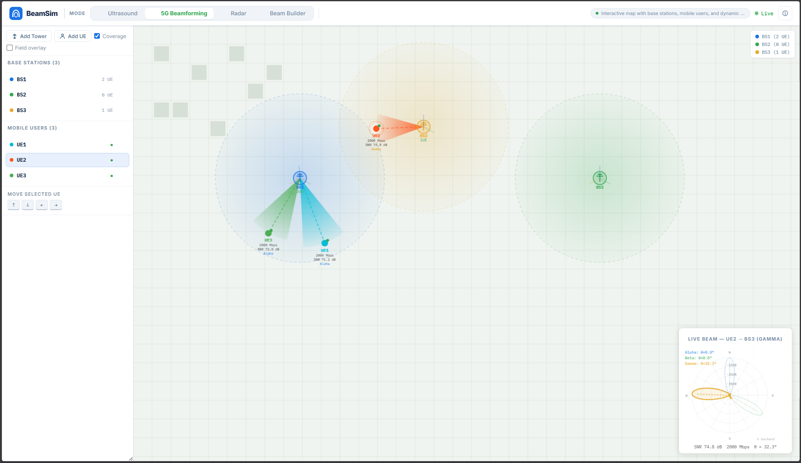

---

### Ultrasound Simulator

#### Shepp–Logan Phantom with Tissue Hover/Edit
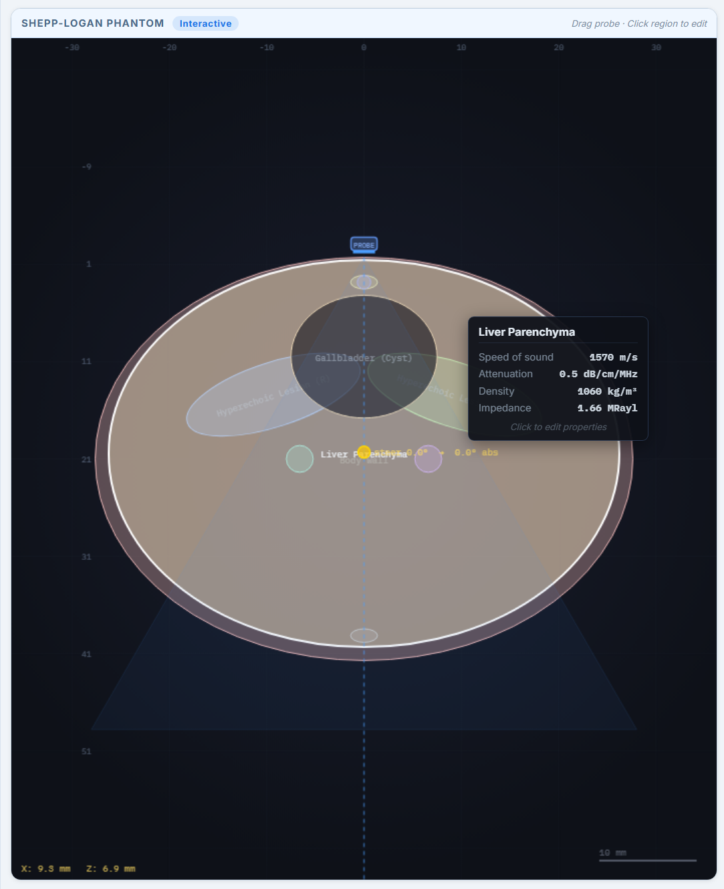

#### A-Mode Output
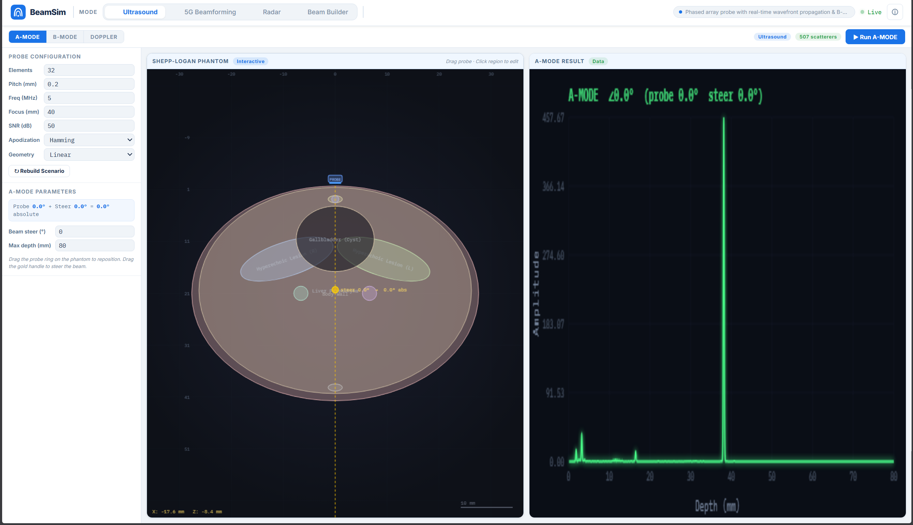

#### B-Mode Reconstruction
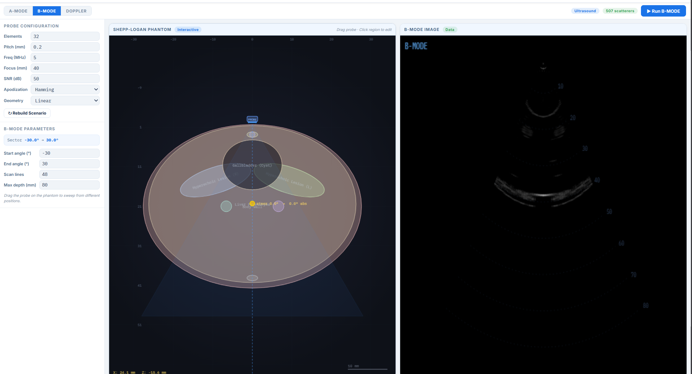

#### Doppler Mode
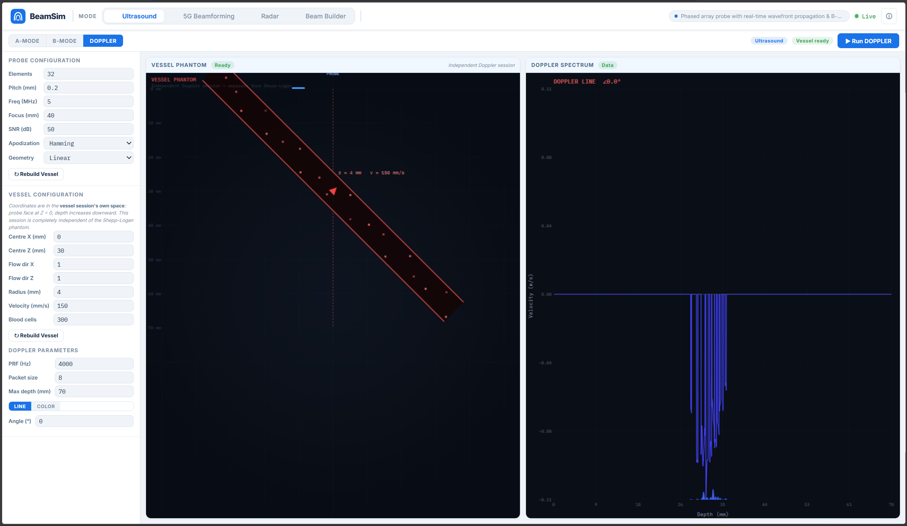
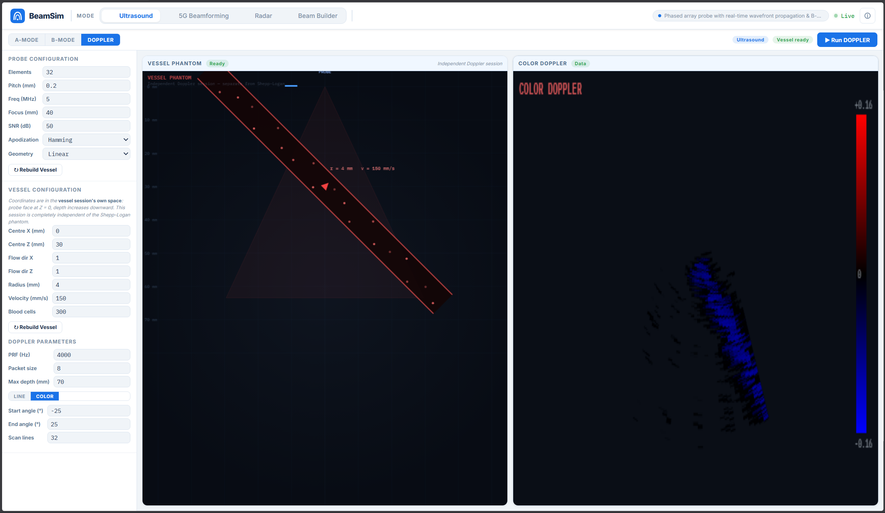

---

### Radar Simulator

#### 360° PPI Scan Display
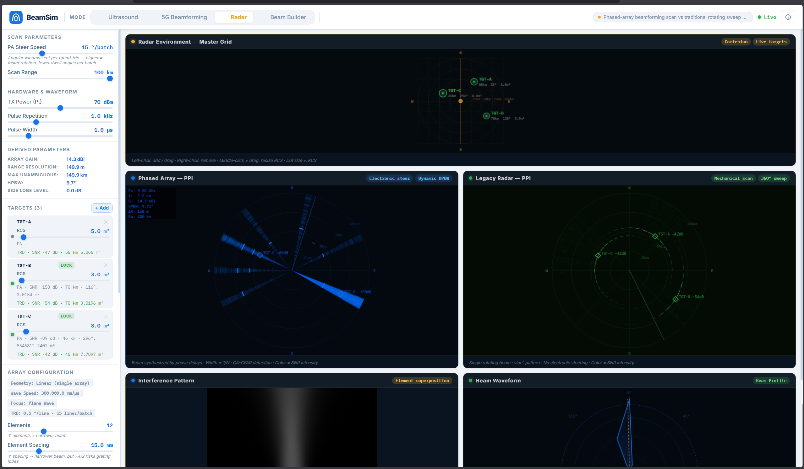

#### Interactive Body Placement and Sizing
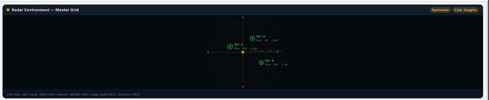

---

## Demo Videos

### Core Beamforming Simulator

https://github.com/user-attachments/assets/36348291-1228-4e79-84d2-666f3a2f59ca

*Demonstrates real-time beam steering, interference map and windowing*

---

### Ultrasound Simulator — A-Mode & B-Mode & Doppler-Mode

https://github.com/user-attachments/assets/721911f8-b32a-4021-a329-27e321dcb66c

*Shows phantom interaction, probe steering, A-mode signal, and B-mode image reconstruction as well as blood vessel simulation, and Doppler output.*

---

### 5G Simulator

https://github.com/user-attachments/assets/4057a158-280c-4f0d-826d-14fe5648f976


*Shows user movement via keyboard, dynamic beam steering updates, and multi-user coverage.*

---


### Radar Simulator

https://github.com/user-attachments/assets/bc85559e-bdf1-4c9e-856f-cb4f602cb9a7

*Shows full 360° scan, body placement/resizing/deletion, and the broad-to-narrow scan workflow.*

---

## Installation

### Prerequisites

- Python 3.10+
- Node.js 18+
- Angular CLI (`npm install -g @angular/cli`)

### Backend (FastAPI)

```bash
cd backend
python -m venv venv
source venv/bin/activate        # Windows: venv\Scripts\activate
pip install -r requirements.txt
uvicorn main:app --reload --host 0.0.0.0 --port 8000
```

### Frontend (Angular)

```bash
cd frontend
npm install
ng serve --open
```

The app will be available at `http://localhost:4200`.

---

## Usage

1. Open the app in your browser at `http://localhost:4200`
2. Select a module from the top navigation: **Simulator**, **5G**, **Ultrasound**, or **Radar**
3. Use the control panel on the left to adjust parameters
4. Observe real-time updates in the synchronized visualization panels

### Keyboard Shortcuts (5G Module)

| Key | Action |
|---|---|
| `W` / `S` | Move User 1 up / down |
| `A` / `D` | Move User 1 left / right |
| `↑` / `↓` | Move User 2 up / down |
| `←` / `→` | Move User 2 left / right |

---

## References

- [Apodization in Ultrasound Imaging](https://www.sciencedirect.com/topics/engineering/apodization)
- [MATLAB Phased Array System Toolbox](https://www.mathworks.com/products/phased-array.html)
- [Shepp–Logan Phantom](https://en.wikipedia.org/wiki/Shepp%E2%80%93Logan_phantom)
- [Phased Array Beamforming](https://www.youtube.com/watch?v=9WxWun0E-PM)
